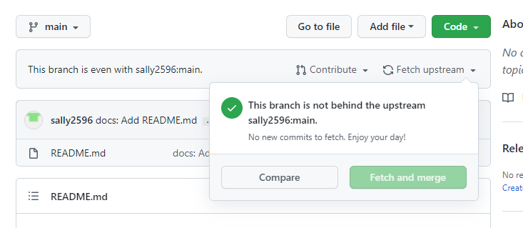
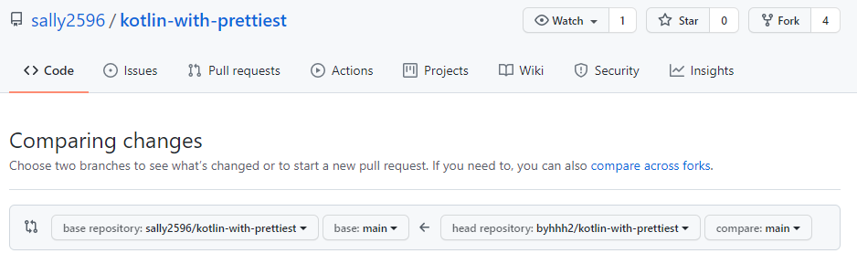

# ✏️  Commit Message Rules

1. Commit 이전에 먼저 `upstream` repository와 동기화 해주세요.
    - Git 홈페이지에서 진행할 경우

        `Fetch and merge` 클릭
        
        

    - Command로 실행할 경우

        $ git pull upstream main 

2. Commit Message는 `[(Unit number)] (pathway number) : (단계 이름)` 로 해주세요.

    $ git commit -m [Unit1] pathway1 : Create a birthday message in Kotlin

3. 본인의 폴더가 없다면 폴더 생성 후 본인의 폴더 안에 데이터를 올리세요.


# ✏️  Pull requests Rules

1. Fork한 개인 reposritory에서 `upstream` repository로 Pull reauest를 보내세요.
    ```
    base repository : sally2596/kotlin-with-prettiest
    branch : main
    ```
    ```
    head repository : (User Github ID)/kotlin-with-prettiest
    compare : (Uploaded branch)
    ```
    
    위와 같이 설정하고 `Create pull request` 를 클릭하세요.
    
    
    
2. Pull requests Message는 `[YYYY.MM.DD] (닉네임)study` 로 해주세요.

    [2021.09.07] sally2596 study
