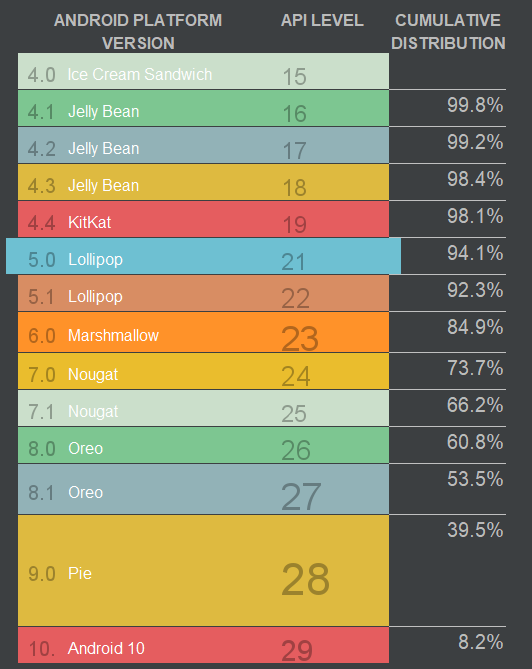
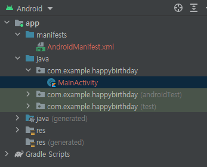
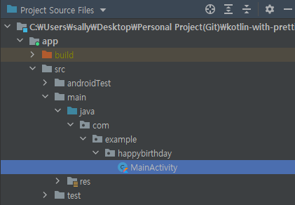

# Pathway2

- **프로젝트 생성시 설정 값**

  - Package Name

    Android 시스템에서 앱을 고유하게 식별하기 위해 사용되는 이름

  - Language

    kotlin 으로 설정

  - Minimum SDK

    앱을 실행할 수 있는 Android의 최소 버전

    (아래의 그림은 프로젝트 생성시 `Help me choose` 링크 클릭으로 확인가능)

    

- 프로젝트 파일 뷰

  - `Android` 클릭

    

  - `Project Source Files` 클릭

    
