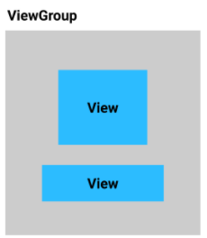
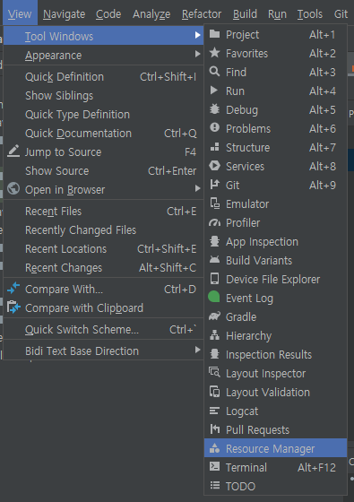
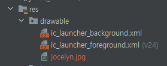
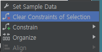

# Pathway3

- **View**

  앱 화면에 표시되는 대부분의 내용

  - TextView

    텍스트를 표시하는 유형

  - View Group

    View 객체가 있을 수 있는 컨테이너

    내부에 있는 View를 정렬함

    

    ConstaintLayout

- **안드로이드 스튜디오 화면 레이아웃**

1. Project 창
2. Palette 창

   앱에 추가할 수 있는 다양한 유형의 `Views` 목록이 나타남

   원하는 목록을 끌어다 4번 화면에 가져다 놓을 수 있음

3. Component Tree 창

   화면 뷰의 다른 표현 (뷰가 모드 나열 되어서 표현 됨)

4. Design View

   앱의 화면 레이아웃 (앱 실행 화면)

5. Blueprint View

   앱의 화면 레이아웃

6. Attributes

   `View` 의 속성을 표시하고 변경할 수 있음

   - Constraint Widget

     

     `+` 를 통해 해당 `View` 와 `ConstraintLayout` 사이의 거리를 설정

     거리의 단위 : 밀도 독립형 픽셀(dp)
     1dp = 1 inch/160 (기기에 따라 달라질 수 있음)

   - Common Attributes

     

     글꼴 크기 단위 : 확장 가능한 픽셀(sp)
     sp와 dp는 같은 크기

---

- ImageView 추가 하기

  1. `View` > `Tool Windows` > `Resource Manager` 클릭

     

  2. `+` > `Import Drawbles` 클릭

     

  3. 사진 Import 후 프로젝트 뷰에서 사진이 있는지 확인

     

  4. Palette 창에서 `ImageView` 드래그 & 드롭
  5. 이미지에 제약조건 걸어주기 (상하좌우 거리 설정)

     제약조건 초기화
     이미지 우클릭 > `Clear Constraints of Selection`

     

- Image 크기 조절하기

  - 화면 크기에 맞게 늘리기

    `match constraints` : `ConstraintsLayout` 에 여백은 뺀 만큼 넓어지라는 의미

    → 이렇게 되면 이미지가 화면 중앙에 배치됨

    

    `Attributes` > `Layout` 탭 하단 위치

  - 이미지 사이즈 조절

    `Common Attributes`> `scaleType` 에서 선택

    

- 속성 에러 해결

  문자열을 파일에 넣고 이름을 지정한 후 문자열을 사용할 때마다 이름을 사용

  → 하드코딩 문자열은 앱을 다른 언어로 번역하기 어렵게 만들고 문자열 재사용이 어려움
